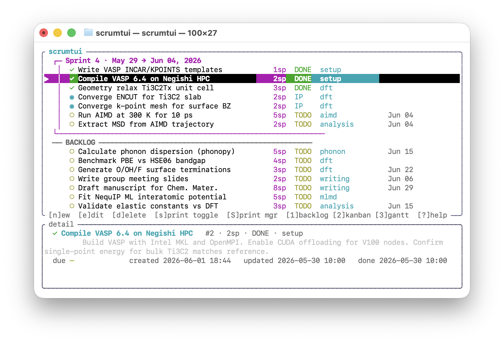

# scrumtui

A minimal, local, terminal-based scrum board driven by keyboard shortcuts.

---

> **⚠ AI-GENERATED CODE DISCLAIMER**
>
> The majority of this codebase was generated with the assistance of Claude Sonnet. It has been reviewed and lightly edited by a human, but has not been rigorously audited. Use at your own risk, and inspect any code before relying on it in a critical context.

---



## What it is

`scrumtui` is a lightweight personal scrum system that lives entirely on your machine. There is no server, no account, no browser. Everything is stored in a single SQLite file at `~/.scrumtui.db`. The UI runs in your terminal using [ratatui](https://github.com/ratatui-org/ratatui).

It has four views:

| View | Key | Description |
|------|-----|-------------|
| **Backlog** | `1` | Full issue list, sprint at the top. Create, edit, delete, and move issues. |
| **Kanban** | `2` | Three-column board (TODO / IN PROGRESS / DONE) for the active sprint. |
| **Gantt** | `3` | Timeline chart grouped by epic, with bar per issue. |
| **Sprint History** | `4` | Browse all past and current sprints with per-sprint issue lists and stats. |

The sprint manager (opened with `S`) includes a live **burnup chart** showing ideal vs. actual story-point completion over the sprint period.

---

## Building

Requires [Rust](https://rustup.rs/) (stable, 1.75+). No system SQLite needed — it is bundled at compile time.

```bash
git clone <this-repo>
cd scrumtui
cargo build --release
./target/release/scrumtui
```

The binary is fully self-contained. You can copy it anywhere on your `PATH`.

On the very first run, the database is empty and **sample data is loaded automatically** so you can explore all views immediately. To reset the sample data, delete `~/.scrumtui.db` and run again.

---

## Usage

### Navigation (all views)

| Key | Action |
|-----|--------|
| `1` / `2` / `3` / `4` | Switch to Backlog / Kanban / Gantt / Sprint History |
| `q` or `Ctrl-C` | Quit |
| `?` | Open / close the help overlay |

### Backlog view

| Key | Action |
|-----|--------|
| `j` / `k` or `↓` / `↑` | Move selection down / up |
| `g` / `G` | Jump to first / last issue |
| `Ctrl-D` / `Ctrl-U` or `PageDown` / `PageUp` | Jump down / up 10 items |
| `R` | Move selected issue up in priority (rank) |
| `r` | Move selected issue down in priority (rank) |
| `>` or `.` | Advance selected issue / subtask to next status |
| `<` or `,` | Regress selected issue / subtask to previous status |
| `n` | Create a new issue |
| `e` or `Enter` | Edit the selected issue (opens the edit form) |
| `d` | Move the selected issue to trash (confirm with `d` again) |
| `T` | Open the trash to restore or permanently delete issues |
| `s` | Toggle the selected issue in/out of the active sprint |
| `S` | Open the sprint manager (create or edit the sprint, view burnup) |
| `/` | Start search / filter |
| `c` | Toggle showing / hiding completed issues |

The sprint is shown at the top with a box around it. Issues below the sprint box are in the backlog. Subtasks are shown indented beneath their parent issue.

### Kanban view

| Key | Action |
|-----|--------|
| `h` / `l` or `←` / `→` | Switch between TODO / IN PROGRESS / DONE columns |
| `j` / `k` | Move selection up / down within a column |
| `>` or `.` | Advance the selected issue to the next status |
| `<` or `,` | Regress the selected issue to the previous status |
| `e` or `Enter` | Edit the selected issue |

### Gantt view

| Key | Action |
|-----|--------|
| `j` / `k` | Scroll down / up |

Issues are grouped by epic. Each issue takes two rows: the title on the first line, and a timeline bar with story points and dates on the second. Bars use `░` (TODO), `▓` (in progress), `█` (done).

### Forms (issue & sprint editor)

| Key | Action |
|-----|--------|
| `Tab` / `Shift-Tab` | Move to next / previous field |
| `h` / `l` (in Status field) | Cycle through TODO → IN PROGRESS → DONE |
| `Space` (in Active toggle) | Toggle sprint active yes/no |
| `Enter` | Save |
| `Esc` | Cancel without saving |

After the last field, `Tab` moves focus into the **Subtasks** section:

| Key (in Subtask section) | Action |
|--------------------------|--------|
| `j` / `k` | Navigate subtasks |
| `e` or `i` | Edit the selected subtask's title |
| `]` or `>` / `[` or `<` | Advance / regress subtask status |
| `x` | Remove (mark deleted, applied on save) |
| `Ctrl-N` | Add a new subtask |
| `Esc` | Return focus to form fields |
| `Enter` | Save the whole form |

Subtasks can also be added when **creating** a new issue. They appear as independent cards on the Kanban board and their statuses are managed independently. A parent issue's status is automatically derived from its subtasks: all Done → Done; all Todo → Todo; any mix → In Progress.

### Trash

When you delete an issue it is moved to the trash (not permanently removed). Open the trash with `T`:

| Key | Action |
|-----|--------|
| `j` / `k` | Navigate |
| `r` | Restore the selected issue |
| `D` | Permanently delete the selected issue (cannot be undone) |
| `Esc` | Close |

### Delete confirmation

When you press `d` on an issue, a confirmation popup appears. Press `d` again to move it to trash, or `n` / `Esc` to cancel.

### Sprint history view

Press `4` to open the sprint history. The left panel lists all sprints (active sprint marked with `●`). Use `j`/`k` to move between sprints. The right panel shows the selected sprint's issues, completion stats, and duration.

---

## CLI

All commands operate on `~/.scrumtui.db` directly without opening the TUI.

```bash
# Create a new issue
scrumtui add "Fix login bug" -e auth -p 2 -d 2026-06-15 --sprint

# Change an issue's status
scrumtui status 42 done

# List open issues
scrumtui list

# List all issues including done, filtered to active sprint
scrumtui list --all --sprint

# Import from Jira CSV export
scrumtui import export.csv

# Export to markdown
scrumtui export issues.md
```

### `add` flags

| Flag | Default | Description |
|------|---------|-------------|
| `-e` / `--epic` | `general` | Epic label |
| `-p` / `--points` | `1` | Story points |
| `-s` / `--status` | `todo` | Initial status: `todo` \| `ip` \| `done` |
| `-d` / `--due` | — | Due date (`YYYY-MM-DD`) |
| `--sprint` | — | Add directly to the active sprint |

### `list` flags

| Flag | Description |
|------|-------------|
| `--all` | Include done issues |
| `--sprint` | Only show active sprint issues |
| `-s` / `--status` | Filter by status: `todo` \| `ip` \| `done` |

---

## Issue fields

| Field | Required | Notes |
|-------|----------|-------|
| Title | ✓ | |
| Story Points | ✓ | Any positive number, including decimals (e.g. `0.5`, `2.5`) |
| Epic | ✓ | Free text label for grouping (e.g. `dft`, `writing`). Autocompletes from existing epics. |
| Status | ✓ | TODO / IN PROGRESS / DONE. Auto-managed when subtasks exist. |
| Due Date | — | Format: `YYYY-MM-DD`. Tab to the field to see a dropdown of existing dates (today always first). |
| Description | — | Free text; shown in the detail pane at the bottom of the backlog |
| Subtasks | — | Independent sub-items with their own status; no story points. Created in the form's Subtasks section. |

All changes are written to the SQLite database immediately on save.

---

## Data

- **Database**: `~/.scrumtui.db` (SQLite, auto-created on first run)
- **Tables**: `issues`, `sprints`, `settings`
- Each issue records `created_at`, `updated_at`, and `completed_at` (set automatically when status becomes DONE)
- The burnup chart in the sprint manager uses `completed_at` to compute actual daily progress

---

## Limitations / known gaps

- Only one sprint can be active at a time
- No sync, no notifications
- The terminal must be at least ~100 columns wide for the full layout to render cleanly
